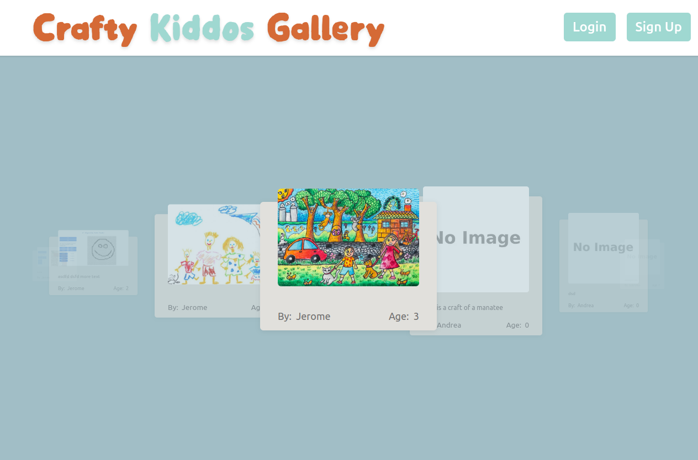

# Crafty Kiddos Gallery

  

### About The Project

Save and share your kid craft or drawing with others before you put them to the "storage bin".
I did this project as my final project of my Course Careers Software Development Fundamentals.
For the backend, I used Golang with gorm to create the API. I'm using a cloud based PostgreSQL database with ElephantSQL. Pictures are uploaded & stored to Amazon S3. It's hosted with Render.
For the frontend, I used Next.js. It's hosted with vercel.

### How I Prepared For The Project

With figma I created a basic fome page idea

  

With DrawSQL I did the first database concept

  

###

### Features

- Carousel with random kids crafts
- Create User
- User create kids and add crafts
- Crafts contains the kid name, age, description and a picture

###

### Next Features

- Make it more responsive
- Add many pictures for the same craft
- Add a like counter on the front page for each craft
